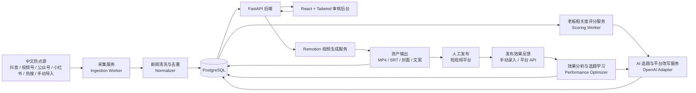
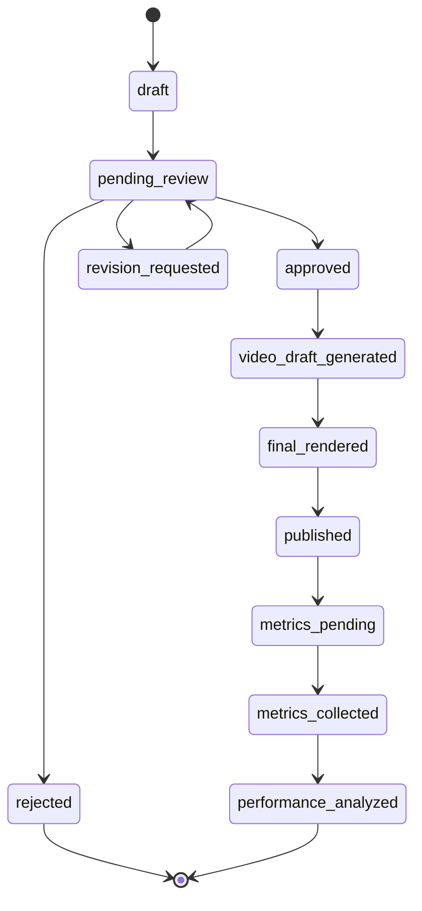

# 中国老板全球化资本趋势短视频系统设计

## 1. 系统架构设计

### 1.1 目标定位

本系统面向“中国老板关注的国际资本与企业全球化”短视频生产流程。核心不是国际新闻翻译，也不是 Bloomberg、Reuters、CNBC、TechCrunch 等国际媒体摘要，而是从中文短视频和中文商业内容平台的热点中筛选出能触发老板圈讨论的内容：

- 热点背后的资本逻辑
- 企业全球化趋势
- 中国老板的焦虑与机会
- 对接新加坡资本市场
- 企业海外融资
- 香港 IPO 路径变化
- 新加坡家族办公室设立
- 海外投资机会对接
- 中国企业全球化资本结构设计

系统原则：

- 不自动发布，必须人工审核。
- AI 只做辅助生成，关键选题、合规表述、最终视频生成由人工确认触发。
- 所有新闻源、AI 输出、审核记录、生成资产可追溯。
- 发布后 24 小时内回收观看、点赞、评论、转发、收藏、咨询线索等表现数据，用于优化后续选题。
- 先支持半自动高质量生产，再逐步增强自动化。

### 1.2 总体模块



### 1.3 服务分层

#### 前端

- 技术栈：React + Tailwind。
- 主要页面：
  - 每日热点看板
  - 选题审核页
  - 选题详情页
  - 视频草稿预览页
  - 新闻源管理页
  - 手动导入页
  - 生成资产下载页
  - 发布效果反馈页
  - 内容表现分析页

#### 后端

- 技术栈：Python FastAPI。
- 职责：
  - 新闻源配置与导入
  - 新闻查询、分类、评分结果管理
  - AI 生成任务编排
  - 审核流转
  - 视频生成任务触发
  - 资产管理
  - 发布记录与效果数据管理
  - 基于表现数据优化选题生成策略
  - 用户与权限

#### 异步任务

建议使用 Celery + Redis，或 RQ + Redis。MVP 可以先用 FastAPI BackgroundTasks，但生产环境建议拆成 worker。

任务类型：

- `fetch_hotspots`: 定时抓取或导入抖音、视频号、公众号、小红书、热搜、雪球及辅助国际媒体热点
- `normalize_news`: 清洗、去重、提取正文
- `score_hotspots`: 分类、中国老板相关度、企业全球化、海外资本与平台传播潜力评分
- `generate_topics`: 每天生成 10 个短视频选题
- `adapt_platform_scripts`: 生成抖音版、视频号版、小红书版脚本与标题
- `generate_video_draft`: 生成 Remotion 输入 JSON
- `render_video`: 渲染 MP4、SRT、封面图
- `collect_video_metrics`: 发布后 24 小时内收集或提醒录入视频表现数据
- `analyze_video_performance`: 分析视频效果，生成选题优化建议

#### 数据库

- PostgreSQL 作为主数据库。
- 新闻正文、AI 输出、分镜 JSON、发布文案等使用 `jsonb` 和 `text` 存储。
- 向量检索可后续引入 `pgvector`，用于历史选题去重、相似热点聚合、客户画像匹配。

#### AI 生成

预留 OpenAI API Adapter，避免业务代码直接依赖某个模型调用格式。

AI 输出建议分四步：

1. 热点理解：摘要、实体、平台来源、评论高频词、风险点、分类标签。
2. 老板相关度判断：热点为什么会影响中国企业老板、CFO、高净值家庭或 IPO 辅导机构。
3. 资本逻辑转译：按“热点 -> 中国老板痛点 -> 资本逻辑 -> 企业全球化影响 -> 业务切入”生成选题。
4. 平台适配与表现学习：生成抖音、视频号、小红书版本，并参考历史表现调整标题角度、客户痛点、业务切入点和脚本结构。

#### 视频生成

- 优先使用 Remotion。
- 后端生成结构化视频草稿 JSON。
- Remotion 根据模板渲染竖屏视频。
- 视频比例：9:16，默认 1080x1920。
- 输出：
  - `.mp4`
  - `.srt`
  - 封面图 `.png`
  - 发布文案 `.txt` 或数据库字段

### 1.4 推荐目录结构

```text
apps/
  web/
    src/
      pages/
      components/
      api/
      types/
  api/
    app/
      main.py
      api/
      core/
      models/
      schemas/
      services/
      workers/
      prompts/
  remotion/
    src/
      compositions/
      templates/
      assets/
packages/
  shared/
docs/
```

### 1.5 每日工作流

1. 定时任务抓取新闻。
2. 系统清洗、去重、聚合相似新闻。
3. 系统对新闻做分类和评分。
4. AI 从高分新闻中生成当天 10 个短视频选题。
5. 用户在后台审核、编辑、拒绝或批准选题。
6. 用户点击“生成视频草稿”。
7. 系统生成 Remotion 草稿、字幕、封面和发布文案。
8. 用户预览视频草稿。
9. 用户确认后生成最终 MP4。
10. 用户自行下载或复制发布文案到短视频平台。
11. 用户在系统中登记发布平台、发布时间和视频链接。
12. 发布后 24 小时内，系统提醒管理员录入或自动拉取播放、点赞、评论、转发、收藏、完播率等数据。
13. 系统分析不同选题、标题、封面、客户痛点、业务切入点的效果。
14. 次日生成选题时，自动参考历史表现，优先推荐更容易带来关注、互动、转发和咨询线索的内容角度。

### 1.6 热点源优先级

热点源权重：

- 抖音热点、抖音财经热点、趋势榜、搜索热词、企业家/商业/财经热门视频、评论区高频关键词：40%
- 微信视频号热门财经内容、企业家内容、商业热点、微信公众号财经文章：25%
- 小红书热门商业/海外内容：20%
- 百度热搜、微博财经、雪球热门讨论：10%
- Bloomberg、Reuters、CNBC、WSJ、Financial Times：5%，仅作国际视角校准

重点关键词：

- AI、IPO、新加坡、香港、家族办公室、企业出海、RWA、中美关系、美股、港股、比特币、全球化、海外融资、海外资产配置

### 1.7 分类与评分模型

内容分类：

- AI 资本化
- 中国老板焦虑
- IPO / 上市
- RWA / Web3 金融
- 新加坡资本市场
- 香港资本市场
- 家族办公室
- 中美关系
- 企业出海
- 跨境并购
- 海外融资

评分维度建议：

- `topic_emotion`: 焦虑 / 机会 / 趋势 / 风险 / 身份焦虑 / 资产安全 / IPO压力
- `china_boss_relevance_score`: 中国企业老板相关度，0-100，权重最高
- `enterprise_globalization_score`: 企业全球化相关度，0-100
- `overseas_capital_score`: 海外资本相关度，0-100
- `wechat_channels_potential_score`: 视频号传播潜力，0-100
- `douyin_potential_score`: 抖音传播潜力，0-100
- `comment_controversy_score`: 评论争议度，0-100
- `collection_value_score`: 收藏价值，0-100
- `international_news_score`: 国际热点程度，0-100，权重最低
- `risk_score`: 合规或舆情风险，0-100，分数越高风险越大
- `final_score`: 综合分

推荐公式：

```text
final_score =
  china_boss_relevance_score * 0.28 +
  enterprise_globalization_score * 0.18 +
  overseas_capital_score * 0.18 +
  wechat_channels_potential_score * 0.10 +
  douyin_potential_score * 0.09 +
  comment_controversy_score * 0.06 +
  collection_value_score * 0.06 +
  international_news_score * 0.05 -
  risk_score * 0.18
```

国际科技新闻翻译、OpenAI 功能更新、国外 AI 工具评测、海外互联网八卦、国外 VC 动态、美国科技公司财报默认降低权重。只有当它们直接关联中国企业融资、全球资本变化、中国企业出海或新加坡资本市场时，才进入候选选题。

### 1.8 视频平台适配

- 抖音版：Hook 强、情绪更强、节奏快，前 3 秒直接点出老板焦虑或机会。
- 视频号版：更稳重、更专业，更像老板圈内容，强调资本逻辑和决策框架。
- 小红书版：更像认知分享和趋势洞察，强调收藏价值、框架、清单和避坑。

### 1.9 发布反馈与选题优化闭环

发布效果反馈模块用于回答三个问题：

- 哪类热点更能吸引目标客户？
- 哪种标题、封面、脚本结构更容易带来互动和转发？
- 哪些内容能带来私信、咨询、合作伙伴关注等真实业务线索？

MVP 阶段建议先做“人工录入 + 系统分析”：

1. 管理员发布视频后，在系统中记录平台、发布时间、视频链接。
2. 系统在发布后 6 小时、24 小时提醒管理员回填数据。
3. 管理员录入观看数、点赞数、评论数、转发数、收藏数、粉丝增长、私信咨询数、有效线索数。
4. 系统计算表现分，并标记爆款、有效线索型、低效内容。
5. 次日 AI 生成选题时，将高表现内容的共同特征写入 prompt 上下文。

后续可接平台 API：

- 抖音开放平台
- 视频号助手数据
- 小红书创作者中心
- YouTube Shorts Analytics
- LinkedIn / TikTok / Instagram Reels

由于各平台开放能力差异较大，建议先把数据模型设计成平台无关结构。

推荐效果指标：

- `view_count`: 观看数
- `like_count`: 点赞数
- `comment_count`: 评论数
- `share_count`: 转发数
- `favorite_count`: 收藏数
- `completion_rate`: 完播率
- `avg_watch_seconds`: 平均观看时长
- `profile_visit_count`: 主页访问数
- `follower_gain`: 新增关注数
- `dm_count`: 私信数
- `lead_count`: 有效咨询线索数

推荐表现分：

```text
engagement_rate = (like_count + comment_count * 2 + share_count * 3 + favorite_count * 2) / max(view_count, 1)

lead_rate = (dm_count + lead_count * 3) / max(view_count, 1)

performance_score =
  normalized_view_score * 0.25 +
  normalized_engagement_score * 0.30 +
  normalized_share_score * 0.15 +
  normalized_completion_score * 0.10 +
  normalized_lead_score * 0.20
```

优化策略：

- 高观看、低咨询：说明话题有传播性，但业务切入弱，下次增强客户痛点和 CTA。
- 低观看、高咨询：说明话题精准但传播弱，下次优化标题、封面和开头 3 秒。
- 高转发：说明内容有认知价值，适合做系列化选题。
- 高评论：说明争议或疑问较多，适合做追问型内容。
- 高收藏：说明工具性强，适合做清单、步骤、避坑类内容。

## 2. 数据库表结构

### 2.1 users

```sql
create table users (
  id uuid primary key default gen_random_uuid(),
  email varchar(255) unique not null,
  name varchar(100),
  role varchar(50) not null default 'editor',
  password_hash text,
  created_at timestamptz not null default now(),
  updated_at timestamptz not null default now()
);
```

### 2.2 news_sources

```sql
create table news_sources (
  id uuid primary key default gen_random_uuid(),
  name varchar(200) not null,
  source_type varchar(50) not null, -- rss, webpage, manual
  url text,
  language varchar(20) default 'zh',
  region varchar(50), -- global, singapore, hongkong, china, us
  category varchar(100),
  is_active boolean not null default true,
  crawl_interval_minutes int not null default 60,
  crawl_config jsonb not null default '{}'::jsonb,
  created_at timestamptz not null default now(),
  updated_at timestamptz not null default now()
);
```

### 2.3 news_items

```sql
create table news_items (
  id uuid primary key default gen_random_uuid(),
  source_id uuid references news_sources(id),
  external_id text,
  title text not null,
  url text,
  author text,
  published_at timestamptz,
  fetched_at timestamptz not null default now(),
  raw_summary text,
  raw_content text,
  normalized_content text,
  language varchar(20),
  region varchar(50),
  status varchar(50) not null default 'new', -- new, normalized, scored, archived
  content_hash varchar(128),
  metadata jsonb not null default '{}'::jsonb,
  created_at timestamptz not null default now(),
  updated_at timestamptz not null default now(),
  unique (source_id, external_id)
);

create index idx_news_items_published_at on news_items(published_at desc);
create index idx_news_items_status on news_items(status);
create index idx_news_items_content_hash on news_items(content_hash);
```

### 2.4 news_clusters

用于合并多个来源报道的同一热点。

```sql
create table news_clusters (
  id uuid primary key default gen_random_uuid(),
  title text not null,
  summary text,
  primary_news_id uuid references news_items(id),
  category varchar(100),
  tags text[] not null default '{}',
  entities jsonb not null default '{}'::jsonb,
  published_from timestamptz,
  published_to timestamptz,
  created_at timestamptz not null default now(),
  updated_at timestamptz not null default now()
);
```

### 2.5 news_cluster_items

```sql
create table news_cluster_items (
  cluster_id uuid references news_clusters(id) on delete cascade,
  news_item_id uuid references news_items(id) on delete cascade,
  similarity_score numeric(5,2),
  created_at timestamptz not null default now(),
  primary key (cluster_id, news_item_id)
);
```

### 2.6 news_scores

```sql
create table news_scores (
  id uuid primary key default gen_random_uuid(),
  cluster_id uuid references news_clusters(id) on delete cascade,
  china_boss_relevance_score int not null default 0,
  enterprise_globalization_score int not null default 0,
  overseas_capital_score int not null default 0,
  wechat_channels_potential_score int not null default 0,
  douyin_potential_score int not null default 0,
  comment_controversy_score int not null default 0,
  collection_value_score int not null default 0,
  international_news_score int not null default 0,
  risk_score int not null default 0,
  final_score numeric(6,2) not null default 0,
  china_boss_fit_reason text,
  capital_logic_reason text,
  risk_reason text,
  recommended_angle text,
  scored_by varchar(50) not null default 'ai',
  model_name varchar(100),
  raw_result jsonb not null default '{}'::jsonb,
  created_at timestamptz not null default now(),
  updated_at timestamptz not null default now(),
  unique (cluster_id)
);
```

### 2.7 content_topics

每天生成的短视频选题。

```sql
create table content_topics (
  id uuid primary key default gen_random_uuid(),
  cluster_id uuid references news_clusters(id),
  production_date date not null,
  status varchar(50) not null default 'draft',
  -- draft, pending_review, approved, rejected, video_draft_generated, final_rendered
  topic_title text not null,
  topic_emotion varchar(50) not null default '机会',
  china_boss_relevance_score numeric(5,2) not null default 0,
  enterprise_globalization_score numeric(5,2) not null default 0,
  overseas_capital_score numeric(5,2) not null default 0,
  wechat_channels_potential_score numeric(5,2) not null default 0,
  douyin_potential_score numeric(5,2) not null default 0,
  comment_controversy_score numeric(5,2) not null default 0,
  collection_value_score numeric(5,2) not null default 0,
  international_news_score numeric(5,2) not null default 0,
  hot_summary text not null,
  target_client text,
  user_pain_point text,
  business_entry_point text,
  cover_title text,
  risk_notice text,
  publish_copy text,
  tags text[] not null default '{}',
  priority int not null default 0,
  ai_model varchar(100),
  ai_raw_output jsonb not null default '{}'::jsonb,
  created_by uuid references users(id),
  reviewed_by uuid references users(id),
  reviewed_at timestamptz,
  review_comment text,
  created_at timestamptz not null default now(),
  updated_at timestamptz not null default now()
);

create index idx_content_topics_date on content_topics(production_date desc);
create index idx_content_topics_status on content_topics(status);
```

### 2.8 topic_scripts

```sql
create table topic_scripts (
  id uuid primary key default gen_random_uuid(),
  topic_id uuid references content_topics(id) on delete cascade,
  script_type varchar(50) not null, -- 30s, 60s, douyin, wechat_channels, xiaohongshu
  hook text,
  body text not null,
  call_to_action text,
  full_script text not null,
  estimated_duration_seconds int,
  version int not null default 1,
  created_at timestamptz not null default now(),
  updated_at timestamptz not null default now(),
  unique (topic_id, script_type, version)
);
```

### 2.9 topic_platform_adaptations

```sql
create table topic_platform_adaptations (
  id uuid primary key default gen_random_uuid(),
  topic_id uuid references content_topics(id) on delete cascade,
  platform varchar(100) not null,
  hook_style varchar(100) not null,
  tone varchar(100) not null,
  title_variant text,
  cover_title text,
  publish_copy text,
  script_id uuid references topic_scripts(id),
  adaptation_payload jsonb not null default '{}'::jsonb,
  created_at timestamptz not null default now(),
  updated_at timestamptz not null default now(),
  unique (topic_id, platform)
);
```

### 2.10 video_storyboards

```sql
create table video_storyboards (
  id uuid primary key default gen_random_uuid(),
  topic_id uuid references content_topics(id) on delete cascade,
  aspect_ratio varchar(20) not null default '9:16',
  style varchar(100) not null default 'finance_advisory',
  scenes jsonb not null,
  subtitle_config jsonb not null default '{}'::jsonb,
  visual_config jsonb not null default '{}'::jsonb,
  version int not null default 1,
  created_at timestamptz not null default now(),
  updated_at timestamptz not null default now()
);
```

`scenes` 示例：

```json
[
  {
    "scene_no": 1,
    "duration": 4,
    "voiceover": "新加坡资本市场最近释放了一个重要信号。",
    "visual": "深色财经背景，叠加新加坡天际线与新闻关键词",
    "on_screen_text": "新加坡资本市场新信号",
    "asset_hint": "singapore_skyline"
  }
]
```

### 2.11 video_assets

```sql
create table video_assets (
  id uuid primary key default gen_random_uuid(),
  topic_id uuid references content_topics(id) on delete cascade,
  asset_type varchar(50) not null, -- mp4, srt, cover, publish_copy, remotion_json
  file_path text not null,
  public_url text,
  file_size bigint,
  mime_type varchar(100),
  render_status varchar(50) not null default 'pending',
  -- pending, rendering, completed, failed
  render_log text,
  metadata jsonb not null default '{}'::jsonb,
  created_at timestamptz not null default now(),
  updated_at timestamptz not null default now()
);
```

### 2.11 publication_channels

用于配置视频发布平台。MVP 阶段可以只记录平台信息，后续再配置 API 授权。

```sql
create table publication_channels (
  id uuid primary key default gen_random_uuid(),
  name varchar(100) not null, -- 抖音, 视频号, 小红书, YouTube Shorts
  platform varchar(100) not null,
  account_name varchar(200),
  account_url text,
  api_enabled boolean not null default false,
  api_config jsonb not null default '{}'::jsonb,
  is_active boolean not null default true,
  created_at timestamptz not null default now(),
  updated_at timestamptz not null default now()
);
```

### 2.12 video_publications

记录最终视频被人工发布到哪个平台。系统不自动发布，但需要知道发布时间和链接，才能在 24 小时内追踪效果。

```sql
create table video_publications (
  id uuid primary key default gen_random_uuid(),
  topic_id uuid references content_topics(id) on delete cascade,
  channel_id uuid references publication_channels(id),
  asset_id uuid references video_assets(id),
  platform varchar(100) not null,
  published_url text,
  published_at timestamptz not null,
  status varchar(50) not null default 'published',
  -- published, metrics_pending, metrics_collected, analyzed
  notes text,
  created_by uuid references users(id),
  created_at timestamptz not null default now(),
  updated_at timestamptz not null default now()
);

create index idx_video_publications_topic on video_publications(topic_id);
create index idx_video_publications_published_at on video_publications(published_at desc);
```

### 2.13 video_performance_snapshots

记录发布后不同时间点的数据。重点是发布后 24 小时表现，也可以保留 6 小时、48 小时、7 天数据。

```sql
create table video_performance_snapshots (
  id uuid primary key default gen_random_uuid(),
  publication_id uuid references video_publications(id) on delete cascade,
  captured_at timestamptz not null default now(),
  hours_since_publish int not null,
  data_source varchar(50) not null default 'manual',
  -- manual, platform_api
  view_count int not null default 0,
  like_count int not null default 0,
  comment_count int not null default 0,
  share_count int not null default 0,
  favorite_count int not null default 0,
  completion_rate numeric(5,2),
  avg_watch_seconds numeric(8,2),
  profile_visit_count int not null default 0,
  follower_gain int not null default 0,
  dm_count int not null default 0,
  lead_count int not null default 0,
  raw_metrics jsonb not null default '{}'::jsonb,
  created_by uuid references users(id),
  created_at timestamptz not null default now()
);

create index idx_video_performance_publication on video_performance_snapshots(publication_id);
create index idx_video_performance_captured_at on video_performance_snapshots(captured_at desc);
```

### 2.14 video_performance_analyses

系统基于 24 小时数据生成分析结论，用来反哺后续选题。

```sql
create table video_performance_analyses (
  id uuid primary key default gen_random_uuid(),
  publication_id uuid references video_publications(id) on delete cascade,
  topic_id uuid references content_topics(id) on delete cascade,
  snapshot_id uuid references video_performance_snapshots(id),
  performance_score numeric(6,2) not null default 0,
  engagement_rate numeric(8,6),
  lead_rate numeric(8,6),
  performance_label varchar(100),
  -- high_reach, high_engagement, high_lead, low_performance, risky_engagement
  winning_factors text[] not null default '{}',
  weak_points text[] not null default '{}',
  recommendation text,
  prompt_learning_summary text,
  analysis_payload jsonb not null default '{}'::jsonb,
  model_name varchar(100),
  created_at timestamptz not null default now(),
  updated_at timestamptz not null default now()
);

create index idx_video_performance_analyses_topic on video_performance_analyses(topic_id);
create index idx_video_performance_analyses_score on video_performance_analyses(performance_score desc);
```

### 2.15 topic_optimization_rules

将表现分析沉淀成可被后续 AI 生成读取的规则。规则可以由系统生成，也可以由管理员手动编辑。

```sql
create table topic_optimization_rules (
  id uuid primary key default gen_random_uuid(),
  rule_type varchar(100) not null,
  -- title, cover, hook, target_client, business_entry, cta, category_weight
  category varchar(100),
  condition text,
  recommendation text not null,
  weight numeric(5,2) not null default 1.0,
  evidence jsonb not null default '{}'::jsonb,
  is_active boolean not null default true,
  generated_by varchar(50) not null default 'system',
  -- system, admin
  created_by uuid references users(id),
  created_at timestamptz not null default now(),
  updated_at timestamptz not null default now()
);

create index idx_topic_optimization_rules_type on topic_optimization_rules(rule_type);
create index idx_topic_optimization_rules_active on topic_optimization_rules(is_active);
```

### 2.16 generation_jobs

```sql
create table generation_jobs (
  id uuid primary key default gen_random_uuid(),
  job_type varchar(100) not null,
  status varchar(50) not null default 'queued',
  -- queued, running, completed, failed, cancelled
  input_payload jsonb not null default '{}'::jsonb,
  output_payload jsonb not null default '{}'::jsonb,
  error_message text,
  started_at timestamptz,
  finished_at timestamptz,
  created_by uuid references users(id),
  created_at timestamptz not null default now(),
  updated_at timestamptz not null default now()
);
```

### 2.17 audit_logs

```sql
create table audit_logs (
  id uuid primary key default gen_random_uuid(),
  actor_id uuid references users(id),
  action varchar(100) not null,
  entity_type varchar(100) not null,
  entity_id uuid not null,
  before_data jsonb,
  after_data jsonb,
  created_at timestamptz not null default now()
);
```

## 3. API 接口设计

### 3.1 认证

```http
POST /api/v1/auth/login
POST /api/v1/auth/logout
GET  /api/v1/auth/me
```

### 3.2 新闻源

```http
GET    /api/v1/news-sources
POST   /api/v1/news-sources
GET    /api/v1/news-sources/{source_id}
PATCH  /api/v1/news-sources/{source_id}
DELETE /api/v1/news-sources/{source_id}
POST   /api/v1/news-sources/{source_id}/test-fetch
```

创建新闻源请求：

```json
{
  "name": "抖音财经趋势榜",
  "source_type": "platform_hotspot",
  "url": "https://example.com/douyin-hotspots",
  "language": "zh",
  "region": "china",
  "platform": "douyin",
  "category": "china_boss_global_capital",
  "priority_weight": 0.4,
  "crawl_interval_minutes": 60
}
```

### 3.3 新闻导入与查询

```http
GET  /api/v1/news-items
GET  /api/v1/news-items/{news_item_id}
POST /api/v1/news-items/manual-import
POST /api/v1/news-items/fetch-now
POST /api/v1/news-items/{news_item_id}/normalize
```

手动导入：

```json
{
  "title": "某企业计划赴新加坡融资",
  "url": "https://example.com/news/1",
  "raw_content": "新闻正文...",
  "published_at": "2026-05-12T09:00:00+08:00",
  "region": "singapore",
  "language": "zh"
}
```

### 3.4 热点聚合与评分

```http
GET  /api/v1/news-clusters
GET  /api/v1/news-clusters/{cluster_id}
POST /api/v1/news-clusters/build
POST /api/v1/news-clusters/{cluster_id}/score
POST /api/v1/news-clusters/score-batch
```

查询参数示例：

```text
GET /api/v1/news-clusters?date=2026-05-12&category=ipo&min_score=70
```

评分响应：

```json
{
  "cluster_id": "uuid",
  "topic_emotion": "IPO压力",
  "china_boss_relevance_score": 94,
  "enterprise_globalization_score": 88,
  "overseas_capital_score": 91,
  "wechat_channels_potential_score": 86,
  "douyin_potential_score": 78,
  "comment_controversy_score": 62,
  "collection_value_score": 88,
  "international_news_score": 38,
  "risk_score": 32,
  "final_score": 84.65,
  "china_boss_fit_reason": "香港 IPO 和海外融资路径会直接影响准备上市企业的融资节奏。",
  "capital_logic_reason": "资本市场窗口变化会倒逼企业提前设计股东结构、上市地和投资人故事。",
  "recommended_angle": "最近香港 IPO 有个变化，老板真正要看的不是热度，而是上市路径。"
}
```

### 3.5 选题生成

```http
GET  /api/v1/topics
POST /api/v1/topics/generate-daily
GET  /api/v1/topics/{topic_id}
PATCH /api/v1/topics/{topic_id}
POST /api/v1/topics/{topic_id}/approve
POST /api/v1/topics/{topic_id}/reject
POST /api/v1/topics/{topic_id}/request-revision
```

生成每日选题请求：

```json
{
  "production_date": "2026-05-12",
  "count": 10,
  "categories": [
    "ai_capital",
    "ipo",
    "singapore_capital_market",
    "family_office",
    "enterprise_globalization"
  ],
  "style": "china_boss_global_capital_advisor",
  "use_performance_learning": true
}
```

选题响应：

```json
{
  "id": "uuid",
  "production_date": "2026-05-12",
  "status": "pending_review",
  "topic_title": "新加坡资本市场窗口期来了，中国企业该怎么准备？",
  "hot_summary": "今日多家媒体关注新加坡市场对海外企业融资的吸引力。",
  "target_client": "计划海外融资或搭建国际资本结构的中国企业创始人、CFO。",
  "user_pain_point": "不知道该选择香港、新加坡还是美国市场，也不清楚融资前需要调整哪些结构。",
  "business_entry_point": "引导用户咨询海外融资路径、新加坡资本市场对接和全球化资本结构设计。",
  "cover_title": "新加坡融资窗口来了？",
  "risk_notice": "不构成投资建议，具体融资路径需结合企业情况判断。",
  "scripts": [
    {
      "script_type": "30s",
      "full_script": "..."
    },
    {
      "script_type": "60s",
      "full_script": "..."
    }
  ],
  "storyboard": {
    "scenes": []
  }
}
```

### 3.6 脚本与分镜

```http
GET  /api/v1/topics/{topic_id}/scripts
POST /api/v1/topics/{topic_id}/scripts/regenerate
PATCH /api/v1/scripts/{script_id}

GET  /api/v1/topics/{topic_id}/storyboard
POST /api/v1/topics/{topic_id}/storyboard/generate
PATCH /api/v1/storyboards/{storyboard_id}
```

### 3.7 视频生成

```http
POST /api/v1/topics/{topic_id}/video-draft
POST /api/v1/topics/{topic_id}/render-final
GET  /api/v1/topics/{topic_id}/assets
GET  /api/v1/video-assets/{asset_id}/download
```

规则：

- `video-draft` 只允许 `approved` 状态调用。
- `render-final` 必须由人工点击触发。
- `render-final` 前必须存在分镜、字幕、封面标题和脚本。

生成视频草稿请求：

```json
{
  "script_type": "60s",
  "template": "finance_advisory_dark",
  "voice": "manual_or_tts_placeholder",
  "resolution": "1080x1920"
}
```

资产响应：

```json
{
  "topic_id": "uuid",
  "assets": [
    {
      "asset_type": "mp4",
      "render_status": "completed",
      "public_url": "/media/videos/topic.mp4"
    },
    {
      "asset_type": "srt",
      "render_status": "completed",
      "public_url": "/media/subtitles/topic.srt"
    },
    {
      "asset_type": "cover",
      "render_status": "completed",
      "public_url": "/media/covers/topic.png"
    }
  ]
}
```

### 3.8 发布与效果反馈

```http
GET  /api/v1/publication-channels
POST /api/v1/publication-channels
PATCH /api/v1/publication-channels/{channel_id}

GET  /api/v1/publications
POST /api/v1/topics/{topic_id}/publications
GET  /api/v1/publications/{publication_id}
PATCH /api/v1/publications/{publication_id}

POST /api/v1/publications/{publication_id}/performance-snapshots
GET  /api/v1/publications/{publication_id}/performance-snapshots
POST /api/v1/publications/{publication_id}/analyze-performance

GET  /api/v1/performance/dashboard
GET  /api/v1/performance/top-topics
GET  /api/v1/performance/learning-summary

GET  /api/v1/topic-optimization-rules
POST /api/v1/topic-optimization-rules
PATCH /api/v1/topic-optimization-rules/{rule_id}
```

登记人工发布记录：

```json
{
  "channel_id": "uuid",
  "asset_id": "uuid",
  "platform": "wechat_channels",
  "published_url": "https://example.com/video/123",
  "published_at": "2026-05-12T20:30:00+08:00",
  "notes": "视频号首发，标题使用新加坡融资窗口角度。"
}
```

录入发布后 24 小时效果：

```json
{
  "hours_since_publish": 24,
  "data_source": "manual",
  "view_count": 12800,
  "like_count": 430,
  "comment_count": 58,
  "share_count": 96,
  "favorite_count": 210,
  "completion_rate": 37.5,
  "avg_watch_seconds": 18.2,
  "profile_visit_count": 168,
  "follower_gain": 42,
  "dm_count": 13,
  "lead_count": 4
}
```

表现分析响应：

```json
{
  "publication_id": "uuid",
  "topic_id": "uuid",
  "performance_score": 84.6,
  "engagement_rate": 0.072,
  "lead_rate": 0.00195,
  "performance_label": "high_lead",
  "winning_factors": [
    "选题直接命中中国企业海外融资痛点",
    "封面标题具备明确问题感",
    "结尾 CTA 引导咨询较自然"
  ],
  "weak_points": [
    "前 3 秒信息密度偏高，可能影响完播"
  ],
  "recommendation": "后续可继续生成新加坡融资窗口、上市路径比较、CFO 决策清单类选题。",
  "prompt_learning_summary": "当热点能连接海外融资路径选择时，标题优先使用问题式表达，并在脚本中加入创始人/CFO 决策场景。"
}
```

规则：

- 系统不自动发布，只记录人工发布后的平台、链接和时间。
- 发布后 24 小时数据是核心优化依据。
- 6 小时数据可用于早期判断标题和封面吸引力。
- 7 天数据可用于判断长尾搜索价值。
- `generate-daily` 默认读取最近 30-90 天高表现内容与优化规则。
- 管理员可以停用某条自动生成的优化规则，避免系统过度追逐短期流量。

### 3.9 任务

```http
GET  /api/v1/jobs
GET  /api/v1/jobs/{job_id}
POST /api/v1/jobs/{job_id}/cancel
```

## 4. 前端审核页面设计

### 4.1 页面目标

审核页面是整个系统的核心控制台。它要帮助用户快速判断：

- 这个热点值不值得做？
- 是否能自然连接到业务？
- 表述是否合规、专业、可信？
- 脚本是否适合短视频？
- 是否批准进入视频生成？

### 4.2 信息架构

页面路径：

```text
/review/topics
/review/topics/:topicId
/publications
/publications/:publicationId
/performance
/performance/learning
```

### 4.3 选题审核列表页

布局：左侧筛选区 + 主列表 + 右侧今日概览。

#### 筛选区

- 日期选择
- 状态：待审核、已通过、已拒绝、需修改、已生成草稿、已渲染
- 分类：AI、IPO、RWA、新加坡、香港、家族办公室、中美关系、企业出海
- 最低综合分
- 风险等级
- 搜索关键词

#### 主列表字段

每条选题卡片包含：

- 综合评分
- 风险分
- 分类标签
- 选题标题
- 热点摘要
- 目标客户
- 业务切入点
- 封面标题
- 状态
- 操作按钮：查看、通过、拒绝、要求修改

#### 右侧今日概览

- 今日已抓取新闻数
- 已聚合热点数
- 已生成选题数
- 待审核数
- 已通过数
- 高风险选题数
- 今日推荐主线：
  - 例如“AI 资本开支升温”
  - 例如“新加坡融资窗口”
  - 例如“香港 IPO 回暖”

### 4.4 选题详情审核页

建议使用三栏布局。

#### 左栏：热点与评分

- 原始新闻标题
- 新闻来源
- 发布时间
- 热点摘要
- 分类标签
- 评分雷达：
  - 热点强度
  - 业务相关度
  - 客户痛点
  - 内容适配度
  - 风险分
- AI 推荐理由
- 风险提示
- 原文链接

#### 中栏：内容审核

可编辑字段：

- 选题标题
- 目标客户
- 用户痛点
- 业务切入点
- 30 秒口播脚本
- 60 秒口播脚本
- 封面标题
- 发布文案
- 风险提示

编辑体验：

- 每个字段支持保存。
- 支持“重新生成本字段”。
- 支持“基于我的修改优化脚本”。
- 脚本显示预计时长和字数。

#### 右栏：视频草稿

- 分镜列表
- 画面文字
- 旁白
- 视觉元素建议
- 模板选择
- 封面预览
- 操作按钮：
  - 保存修改
  - 通过选题
  - 拒绝选题
  - 生成视频草稿
  - 渲染最终视频
  - 登记发布结果

### 4.5 发布效果反馈页

页面路径：

```text
/publications
/publications/:publicationId
```

页面目标：

- 让管理员在视频发布后登记平台、发布时间、视频链接。
- 在发布后 6 小时、24 小时提醒管理员补录数据。
- 显示单条视频表现，并生成对后续选题的优化建议。

#### 发布列表页

字段：

- 发布时间
- 平台
- 选题标题
- 视频链接
- 状态：已发布、待录入 6 小时数据、待录入 24 小时数据、已分析
- 观看数
- 点赞数
- 评论数
- 转发数
- 收藏数
- 私信数
- 有效线索数
- 表现分
- 操作：录入数据、查看分析、生成优化规则

筛选：

- 发布日期
- 平台
- 内容分类
- 表现标签：高观看、高互动、高线索、低表现
- 是否已完成 24 小时反馈

#### 发布详情页

左栏：视频信息

- 选题标题
- 目标客户
- 用户痛点
- 业务切入点
- 封面标题
- 发布文案
- 视频链接
- 平台与发布时间

中栏：数据录入

- 观看数
- 点赞数
- 评论数
- 转发数
- 收藏数
- 完播率
- 平均观看时长
- 主页访问数
- 新增关注数
- 私信数
- 有效咨询线索数
- 数据时间点：6 小时、24 小时、48 小时、7 天

右栏：系统分析

- 表现分
- 互动率
- 线索率
- 表现标签
- 表现好的原因
- 表现弱的原因
- 对后续选题的建议
- 可写入选题生成的学习摘要
- 操作：保存为优化规则、忽略本次分析

### 4.6 内容表现分析页

页面路径：

```text
/performance
/performance/learning
```

核心看板：

- 最近 24 小时发布视频表现
- 最近 7 天 TOP 选题
- 最近 30 天高线索内容
- 分类表现对比：AI、IPO、RWA、新加坡、香港、家族办公室、企业出海
- 标题结构表现：
  - 问题式标题
  - 趋势判断式标题
  - 避坑提醒式标题
  - 清单步骤式标题
- 客户画像表现：
  - 创始人
  - CFO
  - 家族办公室负责人
  - 投资人
  - 海外业务负责人
- 业务切入点表现：
  - 海外融资
  - 新加坡资本市场
  - 家族办公室
  - 海外投资机会
  - 全球化资本结构

学习规则页面：

- 展示系统自动总结的优化规则。
- 管理员可以启用、停用、调高权重、调低权重。
- 每条规则必须展示证据来源，例如来自哪些高表现视频。
- 次日生成选题时，系统只使用已启用规则。

### 4.7 审核与发布状态流转



状态说明：

- `draft`: AI 初步生成，尚未进入审核。
- `pending_review`: 等待人工审核。
- `approved`: 人工确认选题可制作。
- `rejected`: 不制作。
- `revision_requested`: 需要 AI 或人工修改。
- `video_draft_generated`: 已生成视频草稿。
- `final_rendered`: 已生成最终资产。
- `published`: 管理员已人工发布并登记。
- `metrics_pending`: 等待录入或拉取发布效果。
- `metrics_collected`: 已获得发布后效果数据。
- `performance_analyzed`: 系统已完成效果分析并生成优化建议。

### 4.8 前端组件建议

```text
TopicReviewPage
  TopicFilterPanel
  TopicList
    TopicCard
  DailyInsightPanel

TopicDetailPage
  NewsContextPanel
  ScoreBreakdown
  EditableTopicForm
  ScriptEditor
  StoryboardEditor
  VideoDraftPanel
  ReviewActionBar

PublicationListPage
  PublicationFilterPanel
  PublicationMetricsTable
  MetricsReminderPanel

PublicationDetailPage
  PublishedVideoSummary
  PerformanceSnapshotForm
  PerformanceAnalysisPanel
  OptimizationRuleActions

PerformanceDashboardPage
  PerformanceKpiStrip
  TopTopicTable
  CategoryPerformanceChart
  ClientPersonaPerformanceTable
  LearningRuleList
```

### 4.9 Tailwind 视觉方向

风格关键词：

- 专业
- 克制
- 国际化
- 投行感
- 高信息密度

建议视觉：

- 背景：`#F7F8FA`
- 主文本：`#111827`
- 次文本：`#6B7280`
- 强调色：深绿色或金融蓝，避免娱乐化高饱和色
- 风险色：琥珀色 / 红色
- 卡片圆角：`rounded-md`
- 表格和列表优先，不做营销型大卡片堆叠

### 4.10 审核列表页 React 草图

```tsx
export function TopicReviewPage() {
  return (
    <div className="min-h-screen bg-[#F7F8FA] text-gray-900">
      <header className="border-b bg-white px-6 py-4">
        <div className="flex items-center justify-between">
          <div>
            <h1 className="text-xl font-semibold">每日 AI 热点短视频审核</h1>
            <p className="mt-1 text-sm text-gray-500">
              从热点到选题，再到人工确认后的视频草稿。
            </p>
          </div>
          <button className="rounded-md bg-gray-900 px-4 py-2 text-sm font-medium text-white">
            生成今日 10 个选题
          </button>
        </div>
      </header>

      <main className="grid grid-cols-[260px_1fr_300px] gap-4 px-6 py-5">
        <aside className="rounded-md border bg-white p-4">
          <h2 className="text-sm font-semibold">筛选</h2>
          {/* Date picker, status tabs, category filters, risk filter */}
        </aside>

        <section className="space-y-3">
          {/* TopicCard list */}
        </section>

        <aside className="rounded-md border bg-white p-4">
          <h2 className="text-sm font-semibold">今日概览</h2>
          {/* Metrics and recommended narratives */}
        </aside>
      </main>
    </div>
  );
}
```

### 4.11 选题详情页 React 草图

```tsx
export function TopicDetailPage() {
  return (
    <div className="min-h-screen bg-[#F7F8FA]">
      <header className="border-b bg-white px-6 py-4">
        <div className="flex items-center justify-between">
          <div>
            <p className="text-xs font-medium uppercase tracking-wide text-gray-500">
              Pending Review
            </p>
            <h1 className="mt-1 text-xl font-semibold text-gray-900">
              新加坡资本市场窗口期来了，中国企业该怎么准备？
            </h1>
          </div>
          <div className="flex gap-2">
            <button className="rounded-md border px-3 py-2 text-sm">拒绝</button>
            <button className="rounded-md border px-3 py-2 text-sm">要求修改</button>
            <button className="rounded-md bg-gray-900 px-3 py-2 text-sm text-white">
              通过选题
            </button>
          </div>
        </div>
      </header>

      <main className="grid grid-cols-[300px_1fr_360px] gap-4 px-6 py-5">
        <aside className="space-y-4">
          {/* NewsContextPanel */}
          {/* ScoreBreakdown */}
        </aside>

        <section className="space-y-4">
          {/* EditableTopicForm */}
          {/* ScriptEditor */}
        </section>

        <aside className="space-y-4">
          {/* StoryboardEditor */}
          {/* VideoDraftPanel */}
        </aside>
      </main>
    </div>
  );
}
```

## 5. MVP 开发顺序建议

1. 初始化 monorepo：React、FastAPI、PostgreSQL、Remotion。
2. 实现新闻源、新闻导入、新闻列表。
3. 实现热点聚合与基础评分。
4. 接入 OpenAI Adapter，生成每日 10 个选题。
5. 实现选题审核后台。
6. 实现脚本与分镜编辑。
7. 接入 Remotion，先用固定模板生成视频草稿。
8. 输出 MP4、SRT、封面和发布文案。
9. 实现发布记录与 24 小时效果数据手动录入。
10. 实现表现分析、选题优化规则和次日生成选题时的学习上下文。
11. 增加权限、审计日志、任务队列和失败重试。

## 6. 合规与内容风险控制

系统应在生成和审核阶段明确限制：

- 不承诺收益。
- 不暗示确定性融资结果。
- 不构成投资建议。
- 不使用未经确认的内幕信息。
- 涉及中美关系、监管、IPO、RWA 时保留事实来源与风险提示。
- 家族办公室内容避免税务、移民、资产转移等敏感承诺式表达。

每条视频建议默认附加：

```text
以上内容仅作市场观察和商业信息分享，不构成投资、法律或税务建议。具体方案需结合企业实际情况评估。
```
